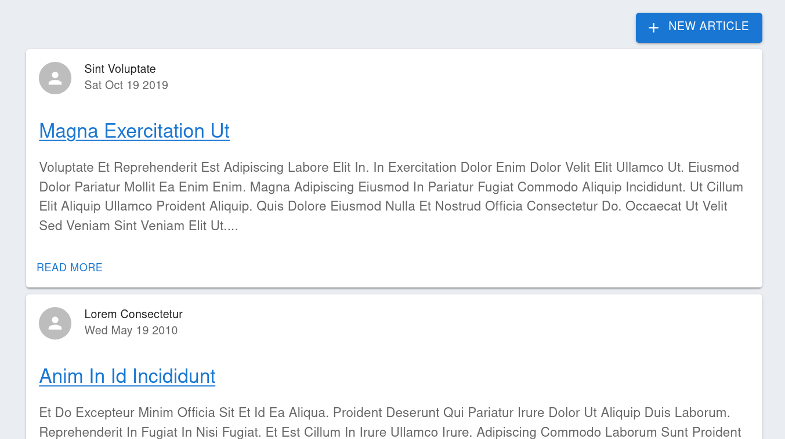

# Monolithic Go and React Application Boilerplate



This repository provides a simple and monolithic service with a server written in Go and frontend with React.  The service does not orient the modern services (like microservices or micro frontends), but you can see the simplicity and easiness of development and deployment.  Sometimes monolithic services are helpful for a small-scale or non-critical business situation such as an internal system.

This project introduce the following languages and frameworks:

- Server-side
    - [Golang][]
    - [gorilla/mux][]
- Frontend
    - [TypeScript][]
    - [React][]
    - [react-router][]
    - [axios][]
    - [MUI][]

The application serves a tiny social blog as a sample.  The users can publish the articles and add comments.  Feel free to customize and build your applications based on this project.

## Quickstart (for development)

The repository contains two projects; for the frontend and server-side.  The frontend project is in [`frontend`][frontend] sub-project,  you can install dependencies and run the debug server by `yarn`:

```console
$ cd frontend
$ yarn install && yarn start
```

Then run server-side service in debug mode by `go run`:

```console
$ go run main.go  -debug
```

You can see the sample application on `http://localhost:8000`

## Sample application: A minimal social blog


The application provides a minimal social blog as a sample.  You can retrieve the articles and publish your article via your browser.  You are also able to send your comment to the articles.

Any frontend page consists of a single page known as a single-page application;  the server responds with a single HTML. The pages transit seamlessly.  The frontend scripts fetch and send articles and comments via APIs asynchronously using  [axios][].  The server-side application provides the following REST APIs:

- `GET /api/health` and `GET /api/ready`: The heath check endpoints to ensure the application lives.  You can see more detail in [Kubernetes docs][configure-liveness-readiness-startup-probes].
- `GET /api/articles`: Get all articles with summaries.
- `GET /api/articles/{article_id}`: Get a article with full content.
- `POST /api/articles`: Create a new article.
- `GET /api/articles/{article_id}/comments`: Get comments of the article `article_id`.
- `POST /api/articles/{article_id}/comments`: Create a new comment for the article_id `article_id`.

## How to develop it

The server-side go service has a debug mode to serve the webpack development server on the same endpoint with APIs.  This is useful to make the frontend scripts able to access APIs with no CORS headers.  Any requests excluding the path starting with `/api/` returns assets served from webpack

### Server-side

The server-side program has two packages, [`repository`][repository] and [`web`][web].  The [`repository`][repository] packages contain interfaces and implementation to read and persist user's requests.  Note that the current implementation server never keeps data. The server loses the article you published or the comments you sent when the restart. If you wish to persist them, try to implement repositories instead of mock storing to the in-memory.

The [`web`][web] packages provide the routes of the request from user's URLs and present responses for the request.  They are known as the controller layer in MVC or DDD.  If you want to add some APIs or add models, implement them to `repository` and `web`, respectively.  If you need more complex logic or use cases, feel free to implement or add new packages.

### Frontend

Any page consists of a single page as known as a single-page application.  The [react-router][] is a library to achieve client-side routing.

The `frontend` sub-project is initialized by [react-scripts][] and keeps the directory structure and build processes.  Every component is in `frontend/src` in flatten.

## How to deploy it to the production

### Manual deploy

You should not use a webpack development server by `yarn start` and `go run` in production.  You need to build them before deployment.  To generate frontend assets, run `yarn build`.  This command generates minified HTML, JavaScript, and CSS.

```console
$ (cd frontend && yarn install && yarn build)
```

To compile a server-side application to create an executable binary, use `go build`:

```console
$ CGO_ENABLED=0 go build -o go-react-boilerplate -trimpath .
```

Then you can confirm to run it by the following:

```console
./go-react-boilerplate -webroot ./frontend/build
```

The server-side also serves asset files from the directory specified by `-webroot`, so you do not need some 3rd-party HTTP server like Apache HTTP server or NGINX.

### Building a Docker container

This repository contains [Dockerfile][Dockerfile].  Using docker containers allows you to develop applications faster and make deployment easier.  The Dockerfile uses multi-stage builds; it contains steps to build frontend and server-side phases.  You can build a docker image and run the container from the image by `docker build` and `docker run`:

```console
$ docker build -t go-react-builderplate .
$ docker run --rm -p 8000:8000 go-react-builderplate
```

## License

[MIT](./LICENSE)

[Golang]: https://golang.org
[gorilla/mux]: https://github.com/gorilla/mux
[TypeScript]: https://www.typescriptlang.org/
[React]: https://reactjs.org/
[react-scripts]: https://www.npmjs.com/package/react-scripts
[react-router]: https://reactrouter.com/
[axios]: https://axios-http.com/
[MUI]: https://mui.com/
[dockerfile]: https://github.com/ueokande/go-react-boilerplate/tree/master/Dockerfile
[repository]: https://github.com/ueokande/go-react-boilerplate/tree/master/repository
[web]: https://github.com/ueokande/go-react-boilerplate/tree/master/web
[frontend]: https://github.com/ueokande/go-react-boilerplate/tree/master/frontend
[frontend/src]: https://github.com/ueokande/go-react-boilerplate/tree/master/frontend/src
[configure-liveness-readiness-startup-probes]: https://kubernetes.io/docs/tasks/configure-pod-container/configure-liveness-readiness-startup-probes/
